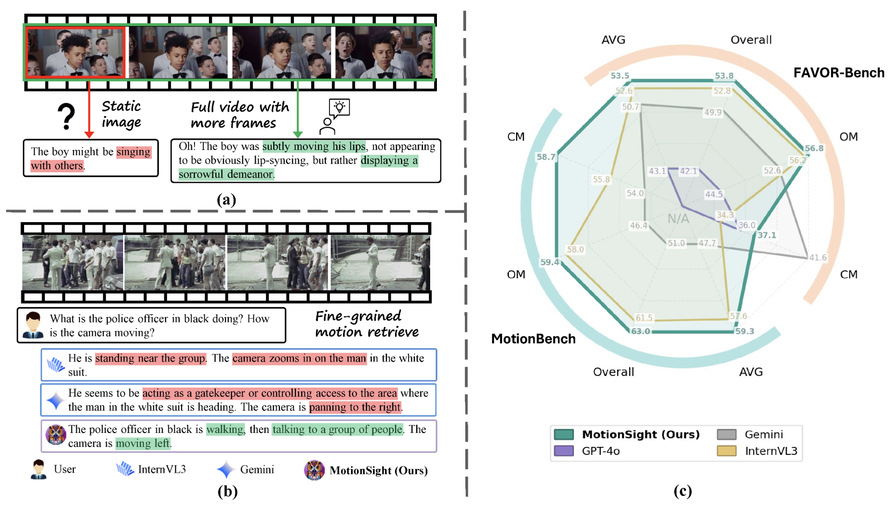

> (†: equal contribution, ~: corresponding author)

## Journal Manuscripts

<blockquote style="margin: 0 0 15px 0; padding: 15px; background-color: #fff; border-left: 4px solid #8B0000; border-radius: 4px;">

<strong><em>MotionSight: Boosting Fine-Grained Motion Understanding in Multimodal LLMs.</em></strong> <a href="https://arxiv.org/pdf/2506.01674.pdf">[Paper]</a>

</blockquote>

<strong>Yipeng Du</strong>*, Tiehan Fan*, Kepan Nan, Rui Xie, Penghao Zhou, Xiang Li, Jian Yang, Zhenheng Yang, Ying Tai <strong>(ICLR2026)</strong>

<!-- ## Early Project

- [Securing Billion Bluetooth Devices leveraging Learning-based Techniques](https://ojs.aaai.org/index.php/AAAI/article/view/30544) *Final year project ([thesis](https://caihanlin.com/mypaper/thesis/UG-thesis.pdf)).* **Hanlin Cai** (Advisors: Zhezhuang Xu, Tozammel Hossain) The 38th Annual AAAI Conference on Artificial Intelligence (AAAI 2024), [Undergraduate Consortium](https://aaai.org/aaai-24-conference/undergraduate-consortium-program/). Vancouver, Canada. February, 2024. 

- Optimizing Traffic Sign Detection System Using Deep Residual Neural Networks Combined with Analytic Hierarchy Process Model *Junior-year course design.* **Hanlin Cai**, Zheng Li, Jiaqi Hu, Wei Hong Lim, Sew Sun Tiang, Mastaneh Mokayef, Chin Hong Wong The 28th International Conference on Artificial Life and Robotics. Beppu, Japan. February, 2023. Recommended for expanding publication in the Journal of Advances in Artificial Life Robotics.

    -->

 